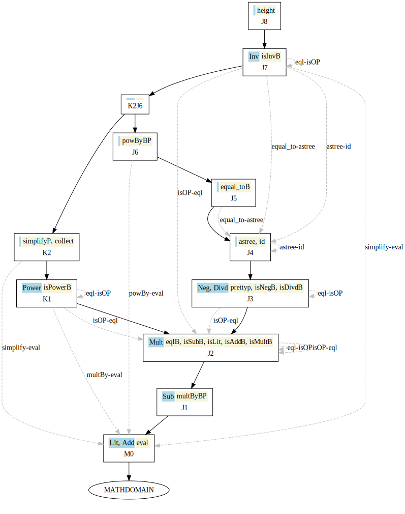
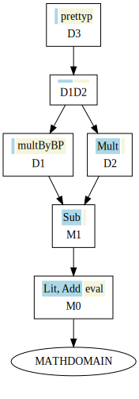
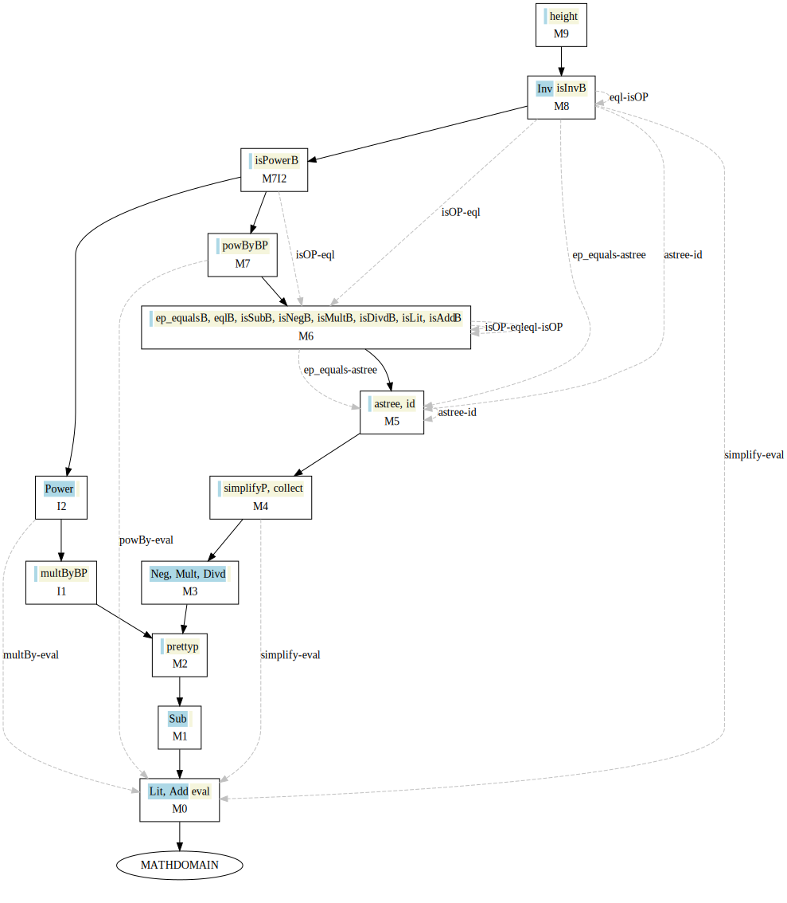
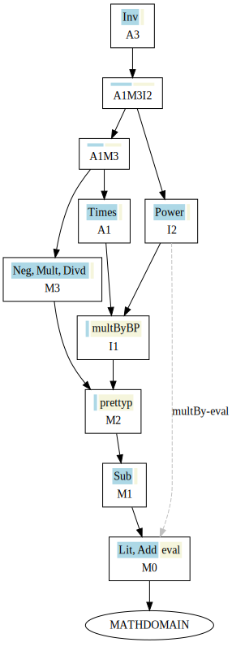
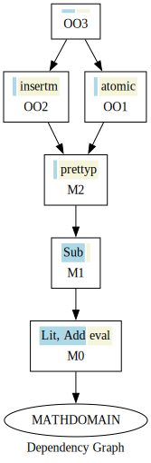
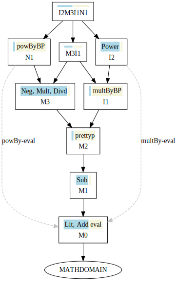
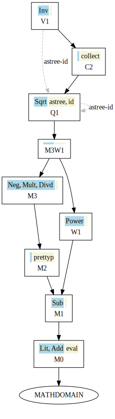

# ExpressionProblem
The goal of this project is to generate a number of approaches (in multiple languages) that address the _Expression Problem_.

As coined by Philip Wadler [1], the Expression Problem is a new name for an old problem. The goal is to define a datatype by cases, where one can add new cases to the datatype and new functions over the datatype, without recompiling existing code, and while retaining static type safety.
 
There are various "solutions" to the Expression Problem. Each solution varies in the amount of code a user must write to implement them, and the language features they require.

In this project, we explore a number of such solutions. Our concern is not with the individual solutions to the Expression Problem (of which there are many), but rather the engineering of these. We provide an alternative, namely, to regenerate all code after modifying the domain.

Let's start with a language for a simple form of arithmetic expressions. We first model the domain using Scala.

Below is a sketch of the [Abstractions](core/src/main/scala/org/combinators/ep/domain/abstractions/abstractions.scala).

```
case class DataType(name: String)

case class DataTypeCase(name: String, attributes: Seq[Attribute]) {
  def isRecursive(): Boolean
  def isNonRecursive(): Boolean = !isRecursive
}

object DataTypeCase {
  def atomic(name: String): DataTypeCase = DataTypeCase(name, Seq.empty)
  def unary(name: String): DataTypeCase = DataTypeCase(name, Seq(Attribute.inner))
  def binary(name: String): DataTypeCase = DataTypeCase(name, Seq(Attribute.left, Attribute.right))
}

object Attribute {
  def inner():Attribute = Attribute("inner", TypeRep.DataType(domain.baseDataType))
  def left():Attribute = Attribute("left", TypeRep.DataType(domain.baseDataType))
  def right():Attribute = Attribute("right", TypeRep.DataType(domain.baseDataType))
}

trait Tag { }

case class Operation(name: String,
  returnType: TypeRep = TypeRep.Unit,
  parameters: Seq[Parameter] = Seq.empty, tags:Seq[Tag] = Seq.empty) {
 
  def isBinary(): Boolean
  def isProducer(): Boolean
}

object Operation {
  val asTree: Operation = Operation("astree", TypeRep.Tree)
}

case class Parameter(name: String, tpe: TypeRep)

object Parameter {
  def that:Parameter = Parameter("that", TypeRep.DataType(domain.baseDataType))
}

trait TypeRep {
  type HostType

  def isModelBase(model:GenericModel):Boolean = this == TypeRep.DataType(model.baseDataType)
}

object TypeRep {
  type OfHostType[T] = TypeRep { type HostType = T }
  case object Unit extends TypeRep
  case object String extends TypeRep
  case object Int extends TypeRep
  case object Double extends TypeRep
  case object Boolean extends TypeRep
  case object Tree extends TypeRep
  case object Sequence[T] extends TypeRep
  case object Array[T] extends TypeRep
  case object Arrow[A,B] extends TypeRep
  case class DataType(tpe:DataType) extends TypeRep
}
```

## GenericModel

Each evolution stage is modeled with a GenericModel, which captures
the newly defined data types and operations together with the
former model(s) that it extends.

Below is a sketch of the [GenericModel](core/src/main/scala/org/combinators/ep/domain/Model.scala).

```
class GenericModel(val name:String,
                   val typeCases:Seq[DataTypeCase],
                   val ops:Seq[Operation],
                   val former:Seq[GenericModel],
                   val baseDataType: DataType,
                   val optimizations: Set[(DataTypeCase,Operation)] = Set.empty) {
  
  def isDomainBase:Boolean
  def isBottom:Boolean
  def toSeq: Seq[GenericModel]
  def inChronologicalOrder: Seq[GenericModel]
  
  override def equals(that: Any): Boolean 
  def before(other: GenericModel): Boolean
  def beforeorEqual(other: GenericModel): Boolean
  def earlier(other: GenericModel): GenericModel 
  def later(other: GenericModel): GenericModel 
  def notComparableTo(other:GenericModel): Boolean
  
  def hasBinaryMethod: Boolean
  def hasProducerOperation: Boolean
  def operationsPresentEarlier(): Set[Operation]
  def operationsPresentEarlier(tpeCase: DataTypeCase) : Set[Operation]
  
  def flatten: Model
  def linearize: Model
  
  def findTypeCase(tpe:DataTypeCase): Option[GenericModel]
  def findOperation(op:Operation): Option[GenericModel]
  def supports(tpe:DataTypeCase): Boolean
  def supports(op:Operation): Boolean
  
  def pastDataTypes: Seq[DataTypeCase]
  def pastOperations: Seq[Operation]
  def isEmpty: Boolean
  
  def lastModelWithOperation: Seq[GenericModel]
  def lastModelWithDataTypes: Seq[GenericModel]
  def base: GenericModel
  def evolve(name:String, types: Seq[DataTypeCase], ops: Seq[Operation], optimizations:Set[(DataTypeCase,Operation)] = Set.empty): GenericModel
  
  def extend(str:String, past:Seq[GenericModel]) : GenericModel
  def merge(name:String, typeCases:Seq[DataTypeCase], ops:Seq[Operation], others:Seq[GenericModel]) : GenericModel
  def optimize(new_opts: Set[(DataTypeCase,Operation)]) : GenericModel
  def haveImplementation(potentialRequest:PotentialRequest): Set[GenericModel]
}

sealed class Model (
   name:String,
   typeCases:Seq[DataTypeCase],
   ops:Seq[Operation],
   bdt: DataType,
   optimizations: Set[(DataTypeCase,Operation)],
   val last:Option[Model] = None) extends GenericModel (name, typeCases, ops, last.toSeq, bdt, optimizations) {
}
```

## Application Domain

The desired application domain (in this case mathematical expressions) extends these traits to provide a specific domain within which to work. The entire evolution history is modeled, from an initial state M0 through successive evolutions. 

The following [MathDomain](domain/math/src/main/scala/org/combinators/ep/domain/math/MathDomain.scala) describes the common domain used in the literature when describing the Expression Problem.
Below is a sketch of the [M0](domain/math/src/main/scala/org/combinators/ep/domain/math/M0.scala) and [M1](domain/math/src/main/scala/org/combinators/ep/domain/math/M1.scala) evolutions:

```
trait Evolution {
  def getModel: GenericModel
}

object MathDomain extends Evolution {
  def getModel:GenericModel = baseModel
  def baseModel:GenericModel = GenericModel.base("MathDomain", "Exp")
  def tests: Seq[TestCase] = Seq.empty
}

object M0 extends Evolution {
  override implicit def getModel:GenericModel = MathDomain.baseModel.evolve("m0", Seq(Lit, Add), Seq(Eval))
  lazy val litValue = Attribute ("value", TypeRep.Double)

  lazy val Lit = DataTypeCase("Lit", Seq(litValue))
  lazy val Add = DataTypeCase.binary("Add")(MathDomain.getModel)

  lazy val Eval = Operation("eval", TypeRep.Double)
}

object M1 extends Evolution {
  override implicit def getModel:GenericModel = M0.getModel.evolve("m1", Seq(Sub), Seq.empty)

  lazy val Sub:DataTypeCase = DataTypeCase.binary("Sub")(MathDomain.getModel)
}                           
```

In this application domain, an initial model (M0) is extended (with M1), adding new data
types and operations. Full Details on the many evolution stages
are found in the domain subproject.

# EpCoGen

Once you have downloaded the code from github, use the following statement
from within the `$HOME` directory.

```
sbt language-java/run
```

This will initiate the generation of Java code for all approaches for the following system:



To generate Scala code for the above system, use the command:

```
sbt language-newScala/run 
```

The generation time will vary, based upon your computer, but it should take about
45 minutes to generate all solutions, in Java, for the EP approaches that
are implemented in EpCoGen.

The resulting files can be found in `$HOME/target/ep-java-j` directory.

Follow instructions in [README.md](scripts/README.md) on how to compile
the code, execute test cases, and generate statistics for the different
EP solutions.

## OO Solution

A straight object-oriented approach requires operations to be added to each data type
class. As new subtypes are created, each can be placed in its own class and there is 
no trouble with existing code; however, defining new operations means that all existing
subtypes need to have new methods added to their class. As such, this is not a solution
to the EP problem:

## Visitor Solution

The Visitor Design Pattern is not an acceptable solution to the Expression Problem 
because defining new data variants (i.e., `Neg` which negates an expression) 
requires modifications to all existing `Visitor` classes. However, using our 
approach, we can simply resynthesize all classes with every change to the 
Application Domain. 

## Interpreter Solution

The Interpreter approach appears promising in that each evolution stage contains its
own classes. `m0` defines classes for the `Lit` and `Add` data type cases, and the `Eval` operation
causes methods to be defined in each class with the necessary logic. Subsequent stages which extend
operations containing the logic must also create their own `Lit` and `Add` data type classes.
Following the Interpreter design pattern creates a code structure where each stage is
placed in its own package, together with an `Exp` class that represents a data type for that
stage. Each data type case is defined in its own class, like `m0.Add` or `m1.Sub`.

However, Interpreter requires the duplicateion of non-trivial logic in subsequent stages for every Producer
Operation that exists, so it cannot be a valid solution to the Expression Problem.

## Covariant Java Solution

The *Modularity 2016* paper [The Expression Problem, Trivially!](http://i.cs.hku.hk/~bruno/papers/Modularity2016.pdf "Expression Problem, Trivially!")
by *Yanling Wang* and *Bruno C. d. S. Oliveira* [2]
describes an approach using _covariant type refinement_ of return types and fields. Unlike existing solutions in
Java-like languages, this solution does not use any kind of generics.

## Interpreter Design Pattern

The *TCS 2003 paper* [Solving Expression problem using Interpreter Pattern](http://www.cs.pomona.edu/~kim/ftp/WOOD.pdf) by 
*Bruce Kim* [3] describes an approach to solving the EP problem using the Interpreter Design Pattern.

## Object Algebras

The *ECOOP 2012 paper* [Extensibility for the Masses](https://dl.acm.org/citation.cfm?id=236716) by 
*Bruno C. d. S. Oliveira & William R. Cook* [4] describes an approach to solving the EP problem using
Object Algebras.

## Covariant Conversions

The *ECOOP 2021 paper* [Covariant Conversions (CoCo): A Design Pattern for Type-Safe Modular Software Evolution in Object-Oriented Systems](https://drops.dagstuhl.de/storage/00lipics/lipics-vol194-ecoop2021/LIPIcs.ECOOP.2021.4/LIPIcs.ECOOP.2021.4.pdf) by
*Jan Bessai, George Heineman, and Boris Duedder* [5] describes an approach to solving the EP problem using
Covariant Conversions.

# Additional Systems

There are a collection of additional Extension Graphs developed to experiment
with different arrangements of evolutions. To generate Java Generated code, execute the following:

```
sbt "language-java/runMain org.combinators.ep.language.java.GenerateAllD1D2"
```

and the files will appear in `target/ep-java-d1d2`

For Scala generated code, execute the following:

```
sbt "language-newScala/runMain org.combinators.ep.language.scala.codegen.GenerateAllD1D2"
```

and the files will appear in `target/ep-scala-d1d2`

Below are a number of systems, and replace the `GenerateXXX` with the values below to generate
all approaches for these systems.

Follow instructions in [README.md](scripts/README.md) on how to compile
the code, execute test cases, and generate statistics for the different
EP solutions.

* `GenerateAllD1D2` - a merge including a producer method, followed by an evolution that added a new operation.



* `GenerateAllMain` - a comprehensive network, with multiple variations that explore
situations with optimized implementations. The next two systems are also part of this
family and are created using this same initial execution.



* A merge based off of another merge.



* Overriding implementations (like a hotpatch fix).



* `GenerateAllMerging` - A merge of three branches.



* `GenerateAllExtended` - Explores adding operations and data types after a merge.



# Dependencies

EpCoGen is compiled with Scala version 2.12.17.

All examples validated on Linux and Windows, using [sbt 1.7.2](https://www.scala-sbt.org/download#previous-releases)
, Scala version 2.12.17 and [Java 11 (OpenJDK)](https://openjdk.org/projects/jdk/11/).

Java code is generated using [JavaParser](https://github.com/javaparser/javaparser) version 3.19.0.

All JUnit tests are compiled using [JUnit 4.12](https://junit.org/junit4/) and Java compiler is directed to
compile only assuming Java 1.8 compatibility.

The images above were generated using [GraphViz online](https://dreampuf.github.io/GraphvizOnline) based on 
output generated by our [GraphViz](core/src/main/scala/org/combinators/ep/domain/GraphViz.scala) code.

All generated Scala code is compiled using Scala version 3.3.3 and version
3.2.19 of the [Scalactic testing framework](https://www.scalatest.org/)

# References

1. Wadler, Philip, [Email to to Java Genericity Mailing List](http://homepages.inf.ed.ac.uk/wadler/papers/expression/expression.txt)
2. Wang, Yanling and C. d. S. Oliveira, Bruno, [The Expression Problem, Trivially!](https://dl.acm.org/citation.cfm?id=2889448), MODULARITY 2016, pp. 37-41.
3. Kim, Bruce, [Some Challenging Typing Issues in Object-Oriented Languages: Extended Abstract](http://doi.org/10.1016/S1571-0661(04)80799-0), TCS 82(8) 2003.
4. d. S. Oliveira, Bruno C. and William R. Cook [Extensibility for the Masses](https://dl.acm.org/citation.cfm?id=236716), ECOOP 2012
5. Bessai, Jan and Heineman, George and Düdder, Boris, [Covariant Conversions (CoCo): A Design Pattern for Type-Safe Modular Software Evolution in Object-Oriented Systems](https://drops.dagstuhl.de/storage/00lipics/lipics-vol194-ecoop2021/LIPIcs.ECOOP.2021.4/LIPIcs.ECOOP.2021.4.pdf), ECOOP 2021.
